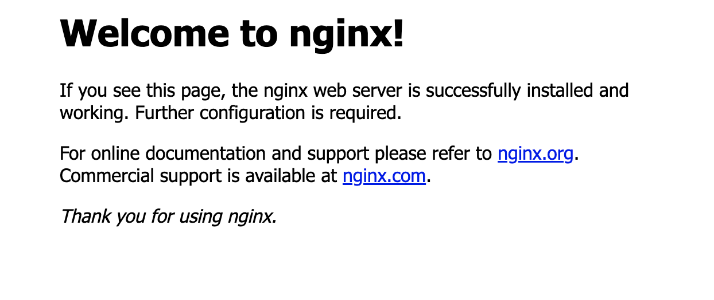

<!--
 * @Author: your name
 * @Date: 2022-04-23 21:29:31
 * @Description: file content
-->
### **1.安装brew**
```
/usr/bin/ruby -e "$(curl -fsSL https://raw.githubusercontent.com/Homebrew/install/master/install)"

```
### **2.查找nginx版本**
```
brew search nginx
```
### **3.安装nginx**
```
brew install nginx
#指定版本安装方式
eg：brew install nginx@1.12.2
```
### **4.卸载nginx**
```
brew uninstall nginx
brew uninstall nginx@版本号
```
###  **5.查看nginx安装信息(eg:安装目录)**
```
brew info nginx
#网页目录： /usr/local/var/www
#默认配置文件：/usr/local/etc/nginx/nginx.conf
#会被加载的配置文件: /usr/local/etc/nginx/servers/
```
###  **6.查看已安装的软件**
```
brew list
```
###  **7.启动、停止、重启nginx(推荐)**
```
brew services start nginx
brew services stop nginx
brew services restart nginx
```
###  **8.nginx原生常用命令启动、停止、重新加载配置文件(不推荐)**

```
nginx #启动nginx
nginx -s reload #重新加载配置文件 ，热加载配置文件
nginx -s quit #:推荐 待nginx进程处理任务完毕进行停止
nginx -s stop #:先查出nginx进程id再使用kill命令强制杀掉进程。
```
###  **9.查询nginx进程：**

```
ps aux|grep nginx
ps -ef|grep nginx
```

### **10.安装成功后**
```
 安装成功 但还需要重启终端 或者 运行 source /Users/XXX/.bash_profile   否则可能无法使用

The default port has been set in /usr/local/etc/nginx/nginx.conf to 8080 so that
nginx can run without sudo.

nginx will load all files in /usr/local/etc/nginx/servers/.

To restart nginx after an upgrade:
  brew services restart nginx
Or, if you don't want/need a background service you can just run:
  /usr/local/opt/nginx/bin/nginx -g daemon off;
```


### **11.运行**

```
http://localhost:8080/

```




### **12.nginx配置**
```
vim /usr/local/etc/nginx/nginx.conf


worker_processes  4;
events {
# 最大并发数
worker_connections  1024;
}
http{
    # 待选服务器列表
    upstream backservers{
        # ip_hash指令，将同一用户引入同一服务器。
        server 127.0.0.1:8081 weight=3 fail_timeout=60s;
        server 127.0.0.1:3000 weight=1;
    }

    server{
        # 监听端口
        listen 8080;
        # 根目录下
        location / {
          root   html;
          index  index.html index.htm;
          # 选择哪个服务器列表
          proxy_pass http://backservers;
        }

    }
}
```

### **13.项目启动(nginx 反向代理 与 负载均衡)**
```
#运行服务器1
cd http-all/04-http-proxy && nodemon index.js

#运行服务器2
cd http-all/04-http-proxy && nodemon two-server

#启动nginx
brew services start nginx

#浏览器访问
http://localhost:8080

```

### **14.vim常用命令**