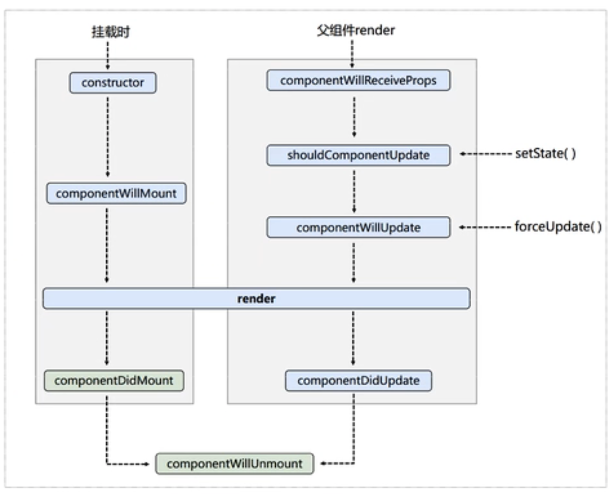
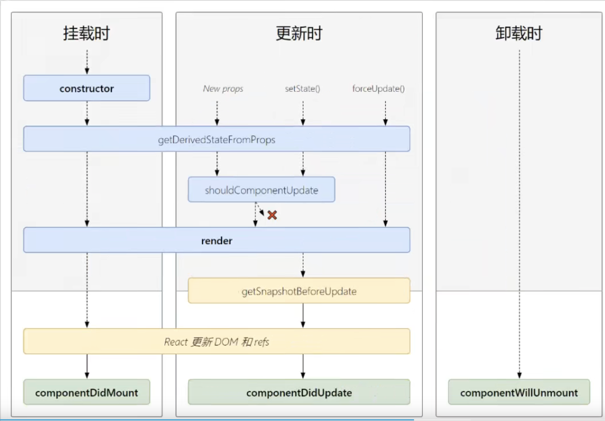
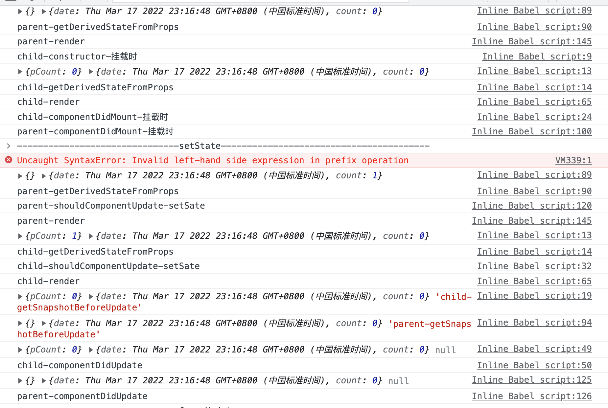

<!--
 * @Author: your name
 * @Date: 2022-02-13 17:11:39
 * @Description: file content
-->
### react17
* 01-html react 的引入 jsx 写法 与 原生createElement写法
### 02-base react基础
* 01-lifeCycleAndState： 生命周期*v16*

* 生命周期*v17* -- 废弃了3个(willMount, willReceiveProps,willUpdate), 新增了2个（getDerivedStateFromProps, getSnapshotBeforeUpdate）

*code-run*

* 02-stateUp： 状态提升

### 02-advance react提高部分

