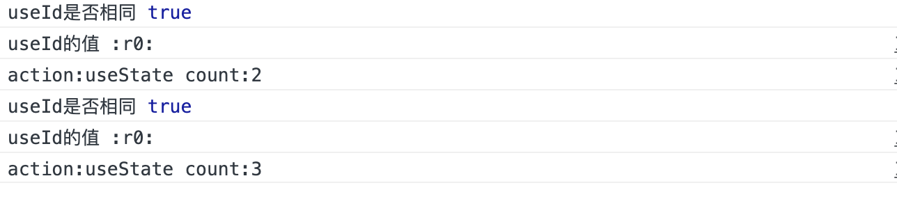
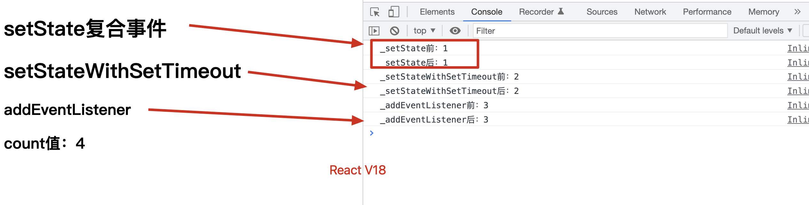

<!--
 * @Author: your name
 * @Date: 2022-02-13 17:11:39
 * @Description: file content
-->
### **react18**
### **react**
* **01-React.useId()** 只是在创建组件的时候产生一次&userId的格式


### **react-dom**
* **01-createRoot**  渲染写法改变 与 批量跟新默认全部开启
式


### **react18 目录结构**
```
tree -L 4  "react18"

react18
├── README.md
├── libs
│   ├── react-dom-client.js // client.js umd改写
│   ├── react-dom.js
│   └── react.js
├── react
│   └── 01-useId.html // hooks: React.useId 产生的是不变的值
└── react-dom
    └── 01-createRoot.html // createRoot代替render, 且大部分开启了批处理

```


